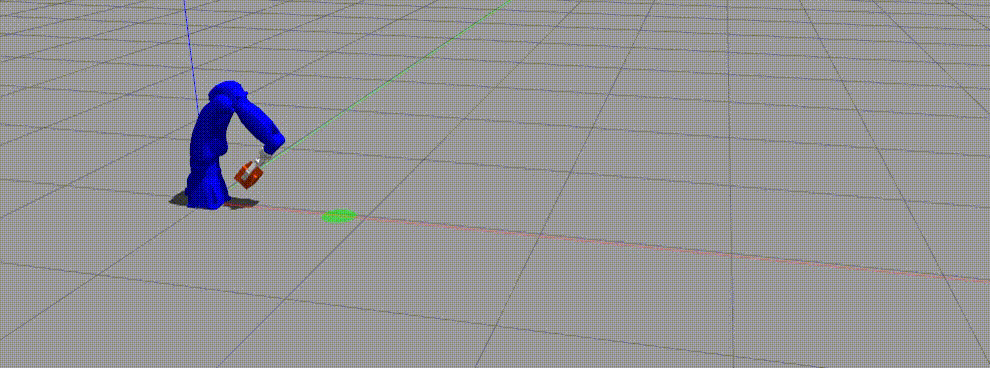

# ThrowBot
The idea of this work is to introduce a new robust methods to teach industrial arms dynamically complex tasks
without any prior knowledge of the robot's kinematic or dynamic models, nor any analytical idea of the dynamic task.

We take advantage of the great generalization abilities of the transformer architecture to show how we can teach an
industrial robotic arm, in a model-free manner, to accurately throw objects to any point within 2 meters radius, 
with minimal amounts of random data.

<h5 align="center">Motoman-gp8 throwing 0.5kg box at generated targets</h5>

## Dependencies
### ROS Dependencies
1. **Motoman**
fixed motoman point-streaming:
https://github.com/MaxorPaxor/motoman_ps

    Motoman original repo: 
    https://github.com/ros-industrial/motoman/tree/kinetic-devel

2. **Robotiq gripper - 2f_140_gripper:**
https://github.com/ros-industrial/robotiq

    **Note**

    Two URDF files must be changed for the gripper to work:

    - robotiq_arg2f_transmission.xacro
    - robotiq_arg2f_140_model_macro.xacro
   
    must be replaced with the files located in robotiq_2f_140_gripper_changed_urdf folder.

3. **Mimic joints plugin:**
https://github.com/roboticsgroup/roboticsgroup_upatras_gazebo_plugins

4. **The-Gazebo-grasp-fix-plugin:**
The gripper has problems with picking objects.
The problems are fixed with Gazebo grasping plugin
https://github.com/JenniferBuehler/gazebo-pkgs/wiki/The-Gazebo-grasp-fix-plugin
