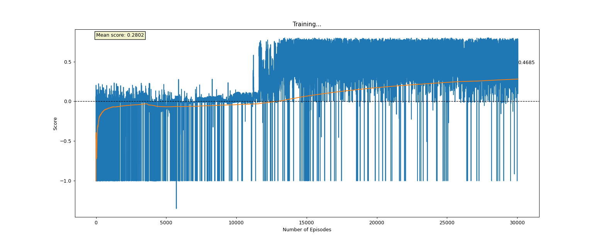

# ThrowBot
The idea of this work is to introduce a new robust methods to teach industrial arms dynamically complex tasks
without any prior knowledge of the robot's kinematic or dynamic models, nor any analytical idea of the dynamic task.

In this project we relay on [Deep Deterministic Policy Gradients](https://arxiv.org/pdf/1509.02971.pdf)
and [Hindsight Experience Replay](https://arxiv.org/pdf/1707.01495.pdf) methods to teach a robotic arm to throw objects.

<p align="center">

</p>
<h5 align="center">Motoman-gp8 throwing 0.5kg box at generated targets</h5>

## Overview

### Environment
We are working with 7-DOF (including the gripper) [Yaskawa's Motoman-GP8 robotic arm](https://www.motoman.com/en-us/products/robots/industrial/assembly-handling/gp-series/gp8)
and using [ROS-Industrial Motoman metapackage](https://github.com/ros-industrial/motoman),
together with Gazebo simulation to create our environment.
Basic robot control as well as our algorithm is written in python. see [Python scripts](../tree/main/src/scripts).

#### General
Since our environment is continuous we sample the state at a fixed frequency of 20Hz and
we restrict the swing time to 0.5 seconds.


#### Velocity Control
The output of our policy network is a normalized [-1, 1] angular velocity vector that goes into the actuators. 
[ROS-Industrial Motoman metapackage](https://github.com/ros-industrial/motoman)
supports only trajectory control (that means, we must input a trajectory as a command to the controller), 
so we use Taylor's Approximation to estimate the next position as follows:
```python
new_angles[i] = current_angles[i] + velocity_vector[i] / UPDATE_RATE
```
The command is inputted with a duration of:
```python
dt = 1.0 / UPDATE_RATE
```
to make sure that all of our transitions between two sequential positions take the same time.
Inorder to create a smooth transition between points we limit the acceleration with the following exponential filter that acts
as LPF on the velocity vector:
```python
smoothed_velocity = old_velocity * smooth_factor + new_velocity * (1 - smooth_factor)
```
Lastly, since the policy outputs normalized velocity vector, we project this vector on a constant array of
the maximum angular velocities allowed by the manufacturer.

[ROS-Industrial Motoman metapackage](https://github.com/ros-industrial/motoman) out-of-the-box controller outputs position to the actuators,
this type of control is good for simulating robot's kinematic behaviour, but fails at simulating any dynamic behaviour.

Inorder to enable a good simulation of the throwing physics, we changed the ros controller to effort-control, 
i.e. the controller outputs efforts (Torques in our case) to the actuators, this allows our simulation to truly simulate the dynamic behaviour object being thrown away.


#### States
We focused on a one axis throw, that means we keep 3 actuators that control the main longitude axis and ignore the other
3 actuators that correspond with side-ways rotations. Adding the gripper we get 4 DOF in total.
The gripper is reduced to a binary actuator - closed or open.
We tested 2 options for state representation:

- Position vector + Velocity Vector
- Lst 3/5 concatenated position vectors

We found out that the second method for state representation worked better, as we let our NN to decide the velocity and acceleration based
on the past few positions.

*Optional state:* A state of the grabbed object orientation might be useful if we grab it differently every time.
For now, we use a constant orientation for the grabbed object.

#### Reward Function
For our reward function we used a smooth continuous function, with a high gradient at the 1.0 mark score. 
We used a polynomial based on the distance from the target as follows:
```python
1.0 - (distance / max_allowed_distance) ** 0.4
```
Where the distance is just L2 (Euclidean) distance from the target.

#### Termination Conditions
We terminate the episode if the following is true:
- Time is over - We then wait for the object to touch the ground, and return the score.
- Gripper was opened - We then wait for the object to touch the ground, and return the score.
- Object was too close to the ground - We penalise this behavior with a -1.0 score.

### Agent
Our algorithm is based on the [Deep Deterministic Policy Gradients](https://arxiv.org/pdf/1509.02971.pdf) paper, 
introducing a policy gradient method at a continuous environment.
And [Hindsight Experience Replay](https://arxiv.org/pdf/1707.01495.pdf) paper, 
allowing us to input a goal to our policy network (for us this is the target location where the object needs to be thrown to).

#### Exploration
For exploration, we use two methods: Near Policy Exploration and Global Exploration. 
Both methods are based on [Ornstein-Uhlenbeck Correlated Noise](https://journals.aps.org/pr/abstract/10.1103/PhysRev.36.823)
and a Hold-Release mechanisms:

  - **Near Policy Exploration:** Soft Noise (sigma=0.4, dt=2e-2, theta=0.1) is naively added to the velocities vector in every action while training.
    In addition, for a small probability (0.3) we prolong the release of the object by 1 step. 
    This allows exploration in the region of the current policy.
  - **Global Exploration:** Strong Noise (sigma=0.8, dt=4e-2, theta=0.0) + Aggressive Release Mechanism. Here we use an epsilon-greedy method with a decaying epsilon.
A strong noise is added to the actions if exploration is rolled, and then we force our gripper to stay closed throughout the episode, and open the gripper if:
    - The last step is reached.
    - Open the gripper at an increasing probability throughout the episode.

    Both of the releasing methods seem to provide good information to the NN regarding the release timing.
    This is a more aggressive exploration method, and it improves the learning times dramatically as it explores far away
    from the policy distribution.

#### Buffer
Since the DDPG algorithm is an off-policy algorithm, we constructed a replay buffer of a 10,000 tuples of
(State, Action, Reward, New State, Done).

### Models
#### Architecture
For both Actor and Critic we used a 4- layer fully connected networks, with ReLu activations for every layer,
except the last activations. For the Actor, since we wanted a [-1, 1] action space, we used a tanh activation.
For the Critic, we didn't use activation on the last layer.
The Actor NN was inputted with a state vector (past 3/5 states of the actuators) and outputted an action vector bound to [-1, 1]
of dimension 4, where the first 3 elements are actuators angular velocities and the last element is a command for the gripper
(a negative number will open the gripper, while a positive number will keep the gripper closed).
The Critic NN was inputted with a [state vector + action vector] and outputted a single number.

Different variations of the FCN were tested to find the best architecture, The performance were determined based on two factors:

**Accuracy:** Mean distance from the target

**Variance:** STD of the distance.

We want both Mean and STD to be low as possible.

| Architecture | Neuron per layer | Batch-Norm | Mean Distance | STD Distance |
| ------------ | ---------------- | ---------- | ------------- | ------------ |
| FC 1L | 128 | No  | 0.3550 | 0.2760 |
| FC 2L | 128 | No  | 0.3371 | 0.2049 |
| FC 3L | 128 | No  | TBT    | TBT    |
| FC 4L | 64  | No  | 0.2315 | 0.1653 |
| FC 4L | 128 | No  | TBT    | TBT    |
| FC 4L | 128 | Yes | TBT    | TBT    |
| FC 4L | 256 | No  | TBT    | TBT    |
| FC 4L + Residual connection | 64  | No  | 0.4558 | 0.3272 |
| FC 4L + Residual connection | 128 | No  | 0.4811 | 0.3419 |
| FC 4L + Residual connection | 128 | Yes | 0.5176 | 0.3732 |
| FC 4L + Residual connection | 256 | No  | TBT    | TBT    |


This table needs to be updated as there were a lot of changes.

TBT - To be tested.

#### Training
We used Adam (Kingma & Ba, 2014) for learning the neural network parameters with a learning
rate of 10−4 for both Critic and Actor. For the Critic we included L2 weight decay of 10−2
and used a discount factor of γ = 0.99. For the target updates we used tau = 0.001.
We trained with minibatch sizes of 128, and trained on 5 minibatches per 1 episode.
We normalized our rewards to [-1, 1] with STD of 1.

<p align="center">

</p>
<h5 align="center">Typical training curve</h5>

### Hindsight Experience Replay 
We implement HER mechanism in our work according to [Hindsight Experience Replay](https://arxiv.org/pdf/1707.01495.pdf) paper.
We change our code so far as follows:
1. We generate a random target in range [0.5 - 2.5] which corresponds to the desired throwing distance
2. The target is concatenated to the state vector S = ( S || T ) 
3. The object is thrown and if it lands inside a radius ε around the target T we return a sparse reward R = 1.0,
otherwise we return R = -1.0.
4. We uniformly generate K more targets in a radius ε' around the landing spot L,
and create K more Markov tuples ((S||T), a, R, (S'||T), done) and insert them to the buffer.

<p align="center">

</p>
<h5 align="center">Motoman-gp8 throwing 0.5kg box at generated targets</h5>

## Dependencies
### ROS Dependencies
1. **Motoman**
fixed motoman point-streaming:
https://github.com/MaxorPaxor/motoman_ps

    Motoman original repo: 
    https://github.com/ros-industrial/motoman/tree/kinetic-devel

2. **Robotiq gripper - 2f_140_gripper:**
https://github.com/ros-industrial/robotiq

    **Note**

    Two URDF files must be changed for the gripper to work:

    - robotiq_arg2f_transmission.xacro
    - robotiq_arg2f_140_model_macro.xacro
   
    must be replaced with the files located in robotiq_2f_140_gripper_changed_urdf folder.

3. **Mimic joints plugin:**
https://github.com/roboticsgroup/roboticsgroup_upatras_gazebo_plugins

4. **The-Gazebo-grasp-fix-plugin:**
The gripper has problems with picking objects.
The problems are fixed with Gazebo grasping plugin
https://github.com/JenniferBuehler/gazebo-pkgs/wiki/The-Gazebo-grasp-fix-plugin
